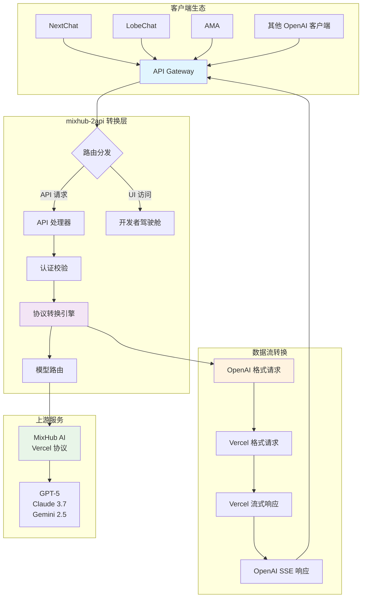
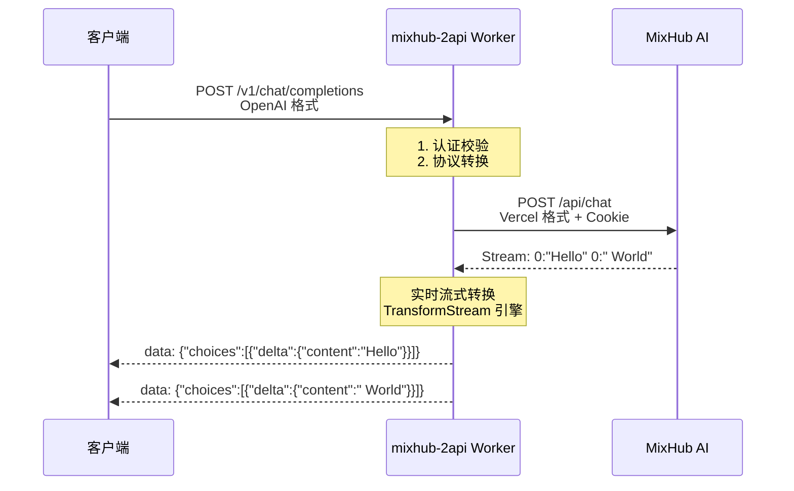

# 大家自行更换自己在https://mixhubai.com/的cookie等等的，因我是免费用户等就没有那积分，如果你有充值VIP不想在官网使用则就可以这样去使用API


# mixhub-2api-cfwork 🌉


**一座连接 MixHub AI 与 OpenAI 生态的数字之桥，让天下没有难用的 API。**

> "我们不是在编写代码，我们是在构建桥梁。每一行代码，都是一块砖石，连接着不同的思想孤岛，让信息的洪流得以自由奔涌。" — 首席AI执行官

---

## ✨ 项目简介

`mixhub-2api` 是一个轻量级、高性能的 Cloudflare Worker 脚本，专门用于将 **MixHub AI** 的 Vercel AI SDK 流式协议实时转换为标准的 **OpenAI API** 格式。

🚀 **核心价值**：让您能够在任何支持 OpenAI API 的客户端中无缝使用 MixHub 提供的丰富模型资源！

---

## 🎯 核心特性

| 特性 | 描述 | 图标 |
|------|------|------|
| **🔄 协议转换** | 实时转换 Vercel 流式协议 → OpenAI SSE 格式 | 🔄 |
| **🎯 结构适配** | 自动转换 `messages` 数组 → `parts` 结构 | 🎯 |
| **🤖 模型丰富** | 内置 GPT-5、Claude 3.7 等前沿模型 | 🤖 |
| **💰 零成本部署** | 基于 Cloudflare Workers 免费套餐 | 💰 |
| **🛠️ 开发者驾驶舱** | 内置美观的 Web UI 调试界面 | 🛠️ |
| **⚡ 一键部署** | 简化部署流程，快速上手 | ⚡ |

---

## 🚀 快速开始

### 方式一：懒人一键部署（推荐）

[](https://deploy.workers.cloudflare.com/?url=https://github.com/lza6/mixhub-2api-cfwork)

**部署步骤：**
1. 点击上方按钮，登录 Cloudflare 账号
2. 为项目命名（如 `my-mixhub-api`）
3. 点击 **部署**
4. 配置环境变量（详见下文）

### 方式二：手动部署

<details>
<summary>📖 点击查看详细手动部署指南</summary>

#### 第一步：获取 MixHub Cookie 🔑

1. **登录 MixHub AI** [官网](https://mixhubai.com/)
2. **打开开发者工具** (F12)
3. **找到网络请求** → 筛选 `chat`
4. **复制 Cookie 值**


#### 第二步：创建 Cloudflare Worker

1. 登录 [Cloudflare Dashboard](https://dash.cloudflare.com/)
2. 进入 **Workers & Pages**
3. 点击 **创建应用程序** → **创建 Worker**
4. 命名并部署

#### 第三步：配置代码和环境

1. **复制本项目代码**到 Worker 编辑器
2. **设置环境变量**：
   - `MIXHUB_COOKIE`: 你的 MixHub Cookie
   - `API_MASTER_KEY`: 自定义 API 密钥

#### 第四步：测试部署

访问你的 Worker 域名，看到开发者驾驶舱即表示成功！

</details>

---

## ⚙️ 环境变量配置

| 变量名 | 必填 | 描述 | 示例 |
|--------|------|------|------|
| `MIXHUB_COOKIE` | ✅ | MixHub 身份凭证 | `sb-auth-token=xxx; ...` |
| `API_MASTER_KEY` | ❌ | API 访问密钥 | `sk-your-secret-key` |

**配置位置**：Worker 设置 → 变量 → 环境变量

---

## 🎮 使用方法

### 在第三方客户端中配置

| 配置项 | 值 | 说明 |
|--------|-----|------|
| **API 地址** | `https://your-worker.workers.dev/v1` | 替换为你的 Worker 地址 |
| **API 密钥** | 你的 `API_MASTER_KEY` | 如未设置，默认为 `1` |
| **模型** | `openai/gpt-5-codex` 等 | 从支持的模型列表中选择 |

### 支持的客户端
- ✅ **NextChat** - 完全兼容
- ✅ **LobeChat** - 完美支持  
- ✅ **AMA** - 即插即用
- ✅ 任何支持 OpenAI API 的客户端

---

## 🏗️ 系统架构



### 🔄 协议转换流程



---

## 🛠️ 技术架构详解

### 核心模块说明

| 模块 | 角色 | 技术栈 | 复杂度 |
|------|------|--------|---------|
| **`CONFIG`** | 中央配置中心 | JSON 配置 | ⭐☆☆☆☆ |
| **`fetch`** | 请求分发器 | Worker Entry Point | ⭐⭐☆☆☆ |
| **`handleApi`** | API 路由管理器 | RESTful 路由 | ⭐⭐☆☆☆ |
| **`handleChatCompletions`** | 核心转换引擎 | Stream API + TransformStream | ⭐⭐⭐⭐☆ |
| **`handleUI`** | Web 界面渲染器 | HTML-in-JS + Tailwind CSS | ⭐⭐⭐☆☆ |

### 🔧 关键技术实现

```javascript
// 核心转换逻辑示例
class ProtocolTransformer {
    async *transformStream(upstreamStream) {
        const decoder = new TextDecoder();
        const encoder = new TextEncoder();
        
        for await (const chunk of upstreamStream) {
            const text = decoder.decode(chunk);
            const lines = text.split('\n');
            
            for (const line of lines) {
                const match = line.match(/^(\d+):(.*)$/);
                if (match && match[1] === '0') {
                    const content = match[2].trim();
                    if (content) {
                        const openAIChunk = createChatCompletionChunk(content);
                        yield encoder.encode(`data: ${openAIChunk}\n\n`);
                    }
                }
            }
        }
    }
}
```

---

## 📊 项目分析

### ✅ 优势亮点

| 方面 | 评分 | 说明 |
|------|------|------|
| **便捷性** | ⭐⭐⭐⭐⭐ | 一键部署，无需运维 |
| **成本效益** | ⭐⭐⭐⭐⭐ | Cloudflare 免费套餐足够 |
| **性能表现** | ⭐⭐⭐⭐☆ | 全球边缘网络，低延迟 |
| **兼容性** | ⭐⭐⭐⭐⭐ | 赋能整个 OpenAI 生态 |
| **用户体验** | ⭐⭐⭐⭐☆ | 开发者驾驶舱设计优秀 |

### ⚠️ 局限性与注意事项

1. **依赖上游服务** - 强依赖 MixHub API 稳定性
2. **Cookie 时效性** - 需要定期更新身份凭证
3. **非官方支持** - 社区驱动项目

---

## 🗺️ 发展路线图

### 🎯 V1.0 - 已实现
- ✅ 核心协议转换
- ✅ 流式输出支持
- ✅ 基础开发者界面
- ✅ 完整模型列表

### 🚀 V2.0 - 规划中
- 🔄 **Cookie 自动续期** - 告别手动更新
- 🔄 **非流式支持** - 完整响应模式
- 🔄 **智能错误处理** - 友好错误信息
- 🔄 **驾驶舱增强** - 历史记录、数据分析
- 🔄 **多上游支持** - 扩展更多 AI 服务

---

## 🤝 贡献指南

我们欢迎各种形式的贡献！包括但不限于：

- 🐛 **问题反馈** - 提交 Bug 报告
- 💡 **功能建议** - 提出新想法
- 🔧 **代码贡献** - Pull Request
- 📖 **文档改进** - 优化使用指南
- 🌍 **社区推广** - 分享使用经验

### 开发环境设置

```bash
# 1. 克隆项目
git clone https://github.com/lza6/mixhub-2api-cfwork.git

# 2. 安装 Wrangler
npm install -g wrangler

# 3. 配置环境变量
wrangler secret put MIXHUB_COOKIE
wrangler secret put API_MASTER_KEY

# 4. 本地开发
wrangler dev
```

---

## 📜 开源协议

本项目采用 **Apache License 2.0** 协议。

**核心权利**：
- ✅ 商业使用
- ✅ 修改分发  
- ✅ 专利授权
- ✅ 私人使用

**主要义务**：
- 📝 保留版权声明
- 📝 声明修改内容

---

## 🎉 即刻开始

### 快速体验
1. [**一键部署**](https://deploy.workers.cloudflare.com/?url=https://github.com/lza6/mixhub-2api-cfwork) - 最简单的开始方式
2. **配置客户端** - 享受无缝 AI 体验
3. **加入社区** - 分享你的使用心得

### 需要帮助？
- 📚 [查看详细文档](https://github.com/lza6/mixhub-2api-cfwork/wiki)
- 💬 [提交问题](https://github.com/lza6/mixhub-2api-cfwork/issues)
- 🎯 [加入讨论](https://github.com/lza6/mixhub-2api-cfwork/discussions)

---

<div align="center">

**如果这个项目对您有帮助，请给我们一个 ⭐ 支持！**

[](https://star-history.com/#lza6/mixhub-2api-cfwork&Date)

**愿这座桥，带您通往更广阔的人工智能世界！**

</div>

---

*最后更新：2025年12月1日 04:17:32*  
*维护者：[@lza6](https://github.com/lza6)*  
*项目状态：🚀 稳定运行中*
